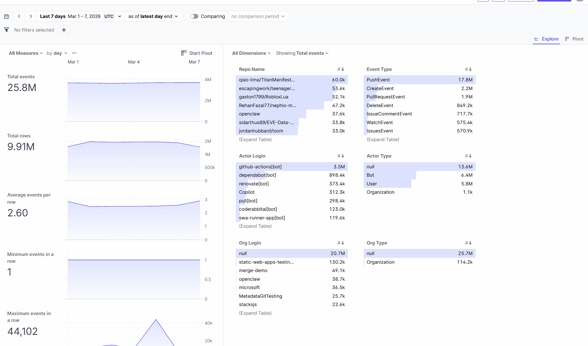
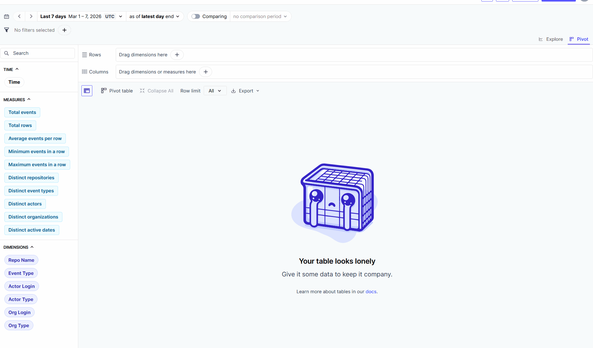

# Bringing the Data Warehouse to Life: Exploring GitHub Data Interactively with Rill

The first post in this series showed how to transform 25.8 million GitHub events into a clean star schema — automatically, locally, without any cloud dependencies. The result is a data warehouse with materialised dimension and fact tables, ready for analysis.

The natural question follows immediately: how do you explore that data without writing a new SQL query for every new question?

With [Rill](https://www.rilldata.com/), the data warehouse opens directly as an interactive dashboard — no separate infrastructure, no per-chart configuration file, no BI server. Rill reads the DuckDB database directly and turns it into an exploratory interface that makes the concepts of cube and drilldown tangible.

---

## Cube and Drilldown — What This Means in Practice

A **cube** is a multidimensional view of aggregated data. Each axis is a dimension — time, event type, repository, actor, organisation — and each cell holds a measure, in this case `event_count`. The mart table `activity_by_date` is nothing more than a pre-aggregated slice of that cube.

**Drilldown** means clicking into the cube: from all events of the week → filtered to a repository name → narrowed to an actor type → down to a single user. Each click adds a filter condition and tightens the view. What would be a new `WHERE` clause in SQL happens in Rill with a single click.

---

## The Mart Layer as the Foundation

Rill is fast when working on materialised, pre-computed tables. The key configuration in the dbt project:

```yaml
models:
  analytics:
    staging:
      +materialized: table
    dimensions:
      +materialized: incremental
    facts:
      +materialized: incremental
    marts:
      +materialized: table
```

Marts are materialised as `table`, not as `view`. The difference matters: a view re-evaluates the full join chain across the 25-million-row fact table on every Rill access. A materialised table contains a few hundred thousand pre-aggregated rows — DuckDB scans them in milliseconds.

A further performance gain comes from a small addition to the schema discovery: the fact table gets two computed columns baked in at build time:

```python
computed_columns = [
    'cast("created_at" as date) AS "created_date"',
    'date_trunc(\'hour\', cast("created_at" as timestamp)) AS "created_hour"',
]
```

This eliminates the runtime `cast` in the mart query — the join to the date dimension becomes a simple equality comparison that DuckDB can resolve without any per-row computation.

---

## Finding Yourself in 25 Million Events

To illustrate what drilldown means in practice, a concrete example is worth more than any diagram. The starting point is the global view: 25.8 million events, no filters.

**Step 1: Repository name.** A single click on `openclaw` in the repo dimension filters the entire view to all events from that repository — 37,600 in the week of 1–7 March 2026.

**Step 2: Actor type.** The `Actor Type` dimension now shows the breakdown within `openclaw`: Bot (15,800), User (12,800), null (9,000). A click on `User` narrows further.

**Step 3: Actor login.** The list of users is now manageable. `steipete` is at the top — 876 events in seven days.

The result is visible in the Explore view: 876 events spread across several repositories (`steipete/gogcli`, `steipete/summarize`, `openclaw.ai` and others), dominated by `IssueCommentEvent` (360) and `PushEvent` (324). The time series shows a clear activity spike around 4 March, then a drop — a pattern that simply would not be visible in a static query.

**

---

## The Pivot View: Structure at a Glance

Alongside the exploratory Explore view, Rill offers a **Pivot view** that arranges dimensions as row and column axes in a classic crosstab layout.

In this example: rows by `Repo Name`, expanded by `Actor Type`, measure `Total events`. The result shows at a glance what the first blog post described as a tendency: the most active repositories of the week are not well-known open-source projects.

`qiao-lima/TitanManife...` leads with 60,000 events, `escapingwork/teenag...` follows with 53,600. Expanded, these repos show almost exclusively Bot activity — automated commits, generated manifests, data pipelines. `openclaw`, by contrast, sits at fifth place with 37,600 events and shows a genuine mix of Bot, User, and null: an actively developed project with human contributors and CI automation.

The Pivot view makes this distinction visible without a single SQL query.

**

---

## What Rill Is Not

Rill is not a full-featured BI tool in the sense of Looker or Metabase. There are no persistent dashboards with access controls, no embedded reports, no complex calculated fields in the UI. If you need a reporting system for multiple stakeholders, this is not the right tool.

What Rill is: a fast exploration tool for people who already know their data and want to ask new questions quickly. The combination with dbt and DuckDB fits naturally — the data warehouse provides the structured, materialised tables, and Rill makes them navigable.

---

## Conclusion

The data warehouse from the first post is necessary, but not sufficient. It takes an interactive layer to turn a set of SQL queries into a genuine exploration tool.

Rill slots into the existing stack with minimal effort: a YAML file pointing at the DuckDB database, and the cube becomes navigable. The investment in a clean star schema with materialised marts pays off directly — as sub-second response times, even across 25 million events.

The full source code is available on GitHub: [idesis-gmbh/githubexperiments](https://github.com/idesis-gmbh/githubexperiments)

---

*Further reading:*
- [Rill](https://www.rilldata.com/)
- [Rill documentation](https://docs.rilldata.com/)
- [GitHub Archive](https://www.gharchive.org/)
- [First post: From Raw JSON to Data Warehouse](https://github.com/idesis-gmbh/githubexperiments)